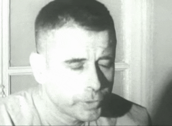
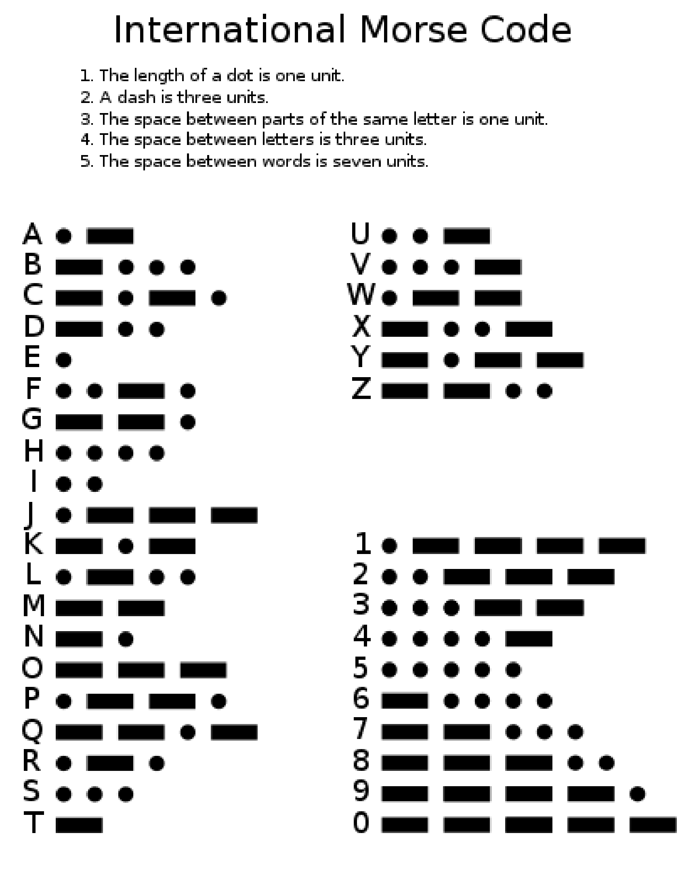

# Blinked Morse Code

 

Jeremiah Andrew Denton Jr. (July 15, 1924 – March 28, 2014) was an American politician and military officer who served as a U.S. Senator representing Alabama from 1981 to 1987. He was the first Republican to win a Senate seat in Alabama. Denton was previously United States Navy Rear Admiral and Naval Aviator taken captive during the Vietnam War.

 
 
 
 
 
 
 
 
 

Denton (the person in the video) was widely known for enduring almost eight years of grueling conditions as an American prisoner of war (POW) in North Vietnam after the A-6 Intruder he was piloting was shot down in 1965. He was the first of all American POWs held captive and released by Hanoi to step off an American plane during Operation Homecoming in February 1973. As one of the earliest and highest-ranking officers to be taken prisoner in North Vietnam, Denton was forced by his captors to participate in a 1966 televised propaganda interview which was broadcast in the United States. While answering questions and feigning trouble with the blinding television lights, Denton blinked his eyes in Morse code, spelling the word "T-O-R-T-U-R-E"—and confirming for the first time to U.S. Naval Intelligence that American POWs were being tortured.

In 1976, Denton wrote When Hell Was in Session about his experience in captivity, which was made into the 1979 film with Hal Holbrook. Denton was also the subject of the 2015 documentary Jeremiah produced by Alabama Public Television.

In 1980, Denton was elected to the U.S. Senate, where he focused mainly on family issues and national security, helping pass the Adolescent Family Life Act (the so-called "Chastity Bill") in 1981 and heading the Judiciary Subcommittee on Security and Terrorism.
